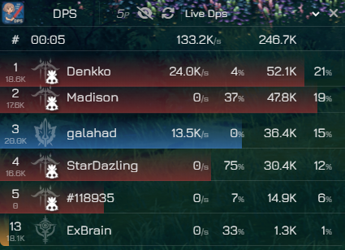
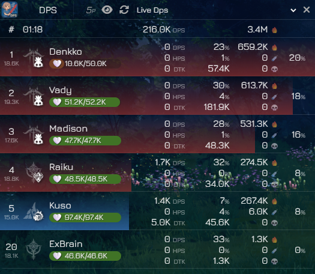

# Ao Meter

Ao (青 - blue in japanese) Meter is a desktop application that acts as a real-time DPS (Damage Per Second) meter for the game **Blue Protocol Star Resonance**.
It overlays the game window to provide detailed combat statistics without interrupting your gameplay.

## Application




## Responsible Use

This tool is designed to help you improve your own performance. **Please do not use it to degrade, harass, or discriminate against other players.** The goal is self-improvement and enjoying the game as a community.

## Compile

Run `npm run dev` in development
Run `npm run build` to compile the project

## Problems

If you have problems because of MSVS, run:

```
set GYP_MSVS_VERSION=2022
set npm_config_msvs_version=2022
set npm_config_clang=0
npm install cap --build-from-source
```

## Installation

1. **Install Npcap:** The application requires Npcap to capture the game's network traffic. If you don't have it installed, get it from its official website [npcap.com](https://npcap.com/dist/npcap-1.84.exe).
2. **Download the installer:** Go to the "Releases" section of this GitHub repository and download the latest version of the installer (`Ao Meter Setup X.X.X.exe`). A Portable version is also available
3. **Run the installer or the portable version:** Execute the downloaded `.exe` file and follow the instructions to install the application on your computer. Alternatively get the portable version and execute the `Ao Meter.exe` file.

## Usage

Once installed, you can launch the application from the Start Menu or the desktop shortcut.
The application will open as an overlay window. When you start the game, it will automatically begin detecting traffic and displaying combat stats.
If you set your uid by argument `--uid=xxxxxx` your stats will always be displayed.
